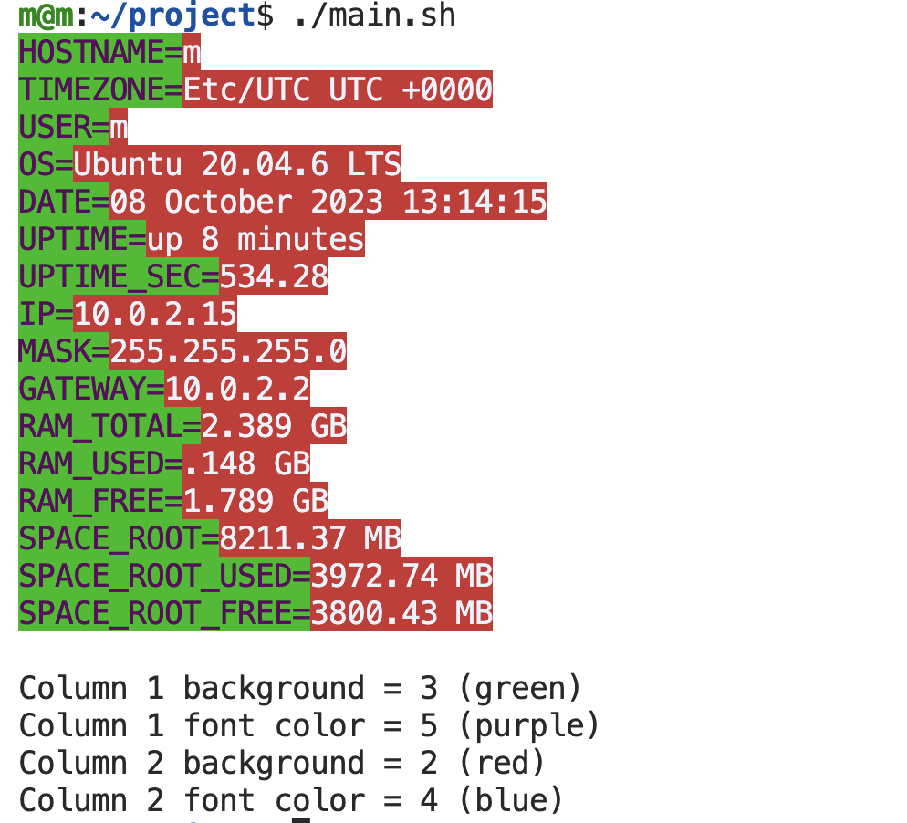

# simple_sys_research
First bash project. Ubuntu 20.04 system research script (with colored output)

## Overview

Script `main.sh` displays some system information (hostname, timezone, user, OS, network data, RAM and root space info). Script requires `net-tools` installed for `ifconfig` command. Script output is colored following the configuration file. You can color background and font of variable (`column1_background`, `column1_font_color`) and value (`column2_background`, `column2_font_color`) separately.

Example of script work:

There are 6 colors available under codes:

+ 1 - white
+ 2 - red
+ 3 - green
+ 4 - blue
+ 5 - purple
+ 6 - black

Using 0 or not specifying variable names will result in choosing color from the delault scheme (`column1_background = 3`, `column1_font_color = 5`, `column2_background = 2`, `column2_font_color = 4`). Using different codes will result in error. Using the same code for font and background color in the same column will result in error.